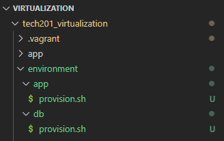
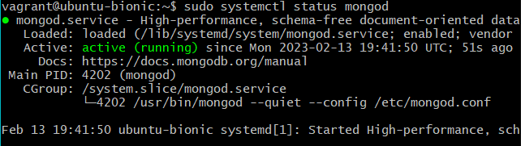

# Guide on how to automate 2 VM's setup via provisioning

Our goal is to automate the process to increase the speed of deployment. 


## Stage.1
First we will need to have 2 separate `provision.sh` files for app and database to be fed different set of instructions like so:


This is a best practice for more readability. 




Next we need to make sure that in the `provision.sh` file for app we have the necessary commands. 


```
#!/bin/bash

sudo apt-get update -y
sudo apt-get upgrade -y
sudo apt-get install nginx -y
sudo systemctl start nginx
sudo systemctl enable
sudo apt-get install python -y
# install nodejs
sudo apt-get install python-software-properties
curl -sL https://deb.nodesource.com/setup_12.x | sudo -E bash -
sudo apt-get install nodejs -y

# install pm2
sudo npm install pm2 -g
```


---
Now we can move onto our `provision.sh` file for datababase. 

First we want to provision the file to have MongoDB. 

The way we do that is like so: 

```
#!/bin/bash

# To install the database we will need a release key
sudo apt-key adv --keyserver hkp://keyserver.ubuntu.com:80 --recv D68FA50FEA312927
echo "deb https://repo.mongodb.org/apt/ubuntu xenial/mongodb-org/3.2 multiverse" | sudo tee /etc/apt/sources.list.d/mongodb-org-3.2.list

sudo apt-get update -y
sudo apt-get upgrade -y

# Install mongodb
sudo apt-get install -y mongodb-org=3.2.20 mongodb-org-server=3.2.20 mongodb-org-shell=3.2.20 mongodb-org-mongos=3.2.20 mongodb-org-tools=3.2.20

sudo systemctl start mongod
sudo systemctl enable mongod
```

To check the functionality of the previous process we can run `vagrant up` in our Bash terminal in VS code and open one GitBash terminal as admin and get into the db machine `vagrant ssh database`. 


If we run `sudo systemctl status mongod` and everything went well so far this should be the output:



---

## Stage.2


