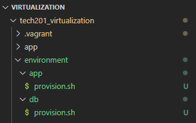
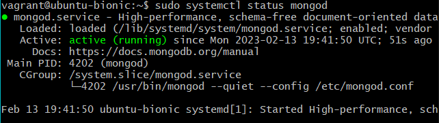
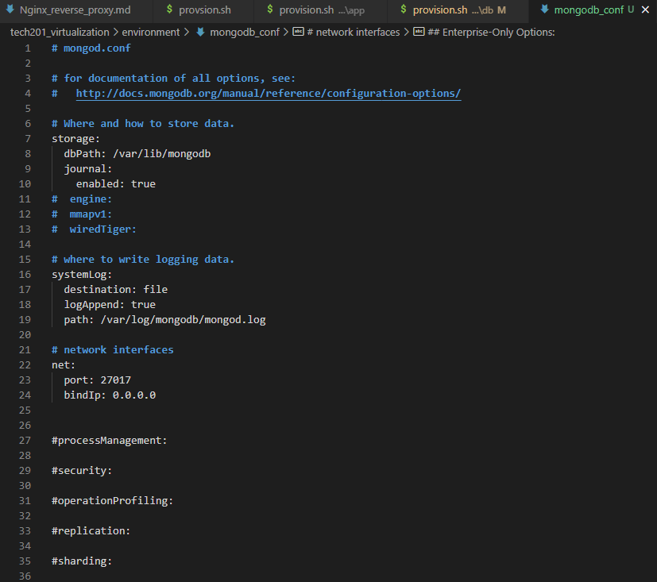

# Guide on how to automate 2 VM's setup via provisioning

Our goal is to automate the process to increase the speed of deployment. 


## Stage.1
First we will need to have 2 separate `provision.sh` files for app and database to be fed different set of instructions like so:


This is a best practice for more readability. 




Next we need to make sure that in the `provision.sh` file for app we have the necessary commands. 


```
#!/bin/bash

sudo apt-get update -y
sudo apt-get upgrade -y
sudo apt-get install nginx -y
sudo systemctl start nginx
sudo systemctl enable
sudo apt-get install python -y
# install nodejs
sudo apt-get install python-software-properties
curl -sL https://deb.nodesource.com/setup_12.x | sudo -E bash -
sudo apt-get install nodejs -y

# install pm2
sudo npm install pm2 -g
```


---
Now we can move onto our `provision.sh` file for datababase. 

First we want to provision the file to have MongoDB. 

The way we do that is like so: 

```
#!/bin/bash

# To install the database we will need a release key
sudo apt-key adv --keyserver hkp://keyserver.ubuntu.com:80 --recv D68FA50FEA312927
echo "deb https://repo.mongodb.org/apt/ubuntu xenial/mongodb-org/3.2 multiverse" | sudo tee /etc/apt/sources.list.d/mongodb-org-3.2.list

sudo apt-get update -y
sudo apt-get upgrade -y

# Install mongodb
sudo apt-get install -y mongodb-org=3.2.20 mongodb-org-server=3.2.20 mongodb-org-shell=3.2.20 mongodb-org-mongos=3.2.20 mongodb-org-tools=3.2.20

sudo systemctl start mongod
sudo systemctl enable mongod
```

To check the functionality of the previous process we can run `vagrant up` in our Bash terminal in VS code and open one GitBash terminal as admin and get into the db machine `vagrant ssh database`. 


If we run `sudo systemctl status mongod` and everything went well so far this should be the output:




Then we need to open another GitBash terminal as admin and `vagrant ssh app` into the app VM.

We create an environment variable using `sudo nano .bashrc`. 

At the bottom we write this code `export DB_HOST=mongodb://192.168.10.150:27017/posts`

To come out of this editor `ctrl+x`, we select `y` and enter.

After we need to run that file for the changes to take effect using `source .bashrc`.

To check if our variable has been created `printenv DB_HOST`, if the variable has been displayed then we `cd app` and we will need to install the app `sudo npm install`. 

Following with `node seeds/seed.js` and lastly, `node app.js` to run the app. 

In the browser we can see that the app has been populated and the posts are displayed. 


---

## Stage.2 - further provisioning 

Stage 2 consists of provisioning changes in the `mongod.conf` file when we boot up the machine. Before we destroy the database machine we will have to copy the contents of `mongod.conf` file and paste it in the newly created file by us in our environment folder.

In this case we will call the new folder `mongodb_conf`. After that we can safely destroy the machines. 


Bellow we can see the content of the `mongod.conf` file that we copied into our new `mongodb_conf` file and we change the bindIP to `0.0.0.0`


Then we need to come back to our database provision file and add the following commands:

- `sudo rm /etc/mongod.conf` - This command removes the configuration of `mongod.conf`
- `sudo cp environment/mongodb_conf /etc/mongod.conf` - Then we need to copy the newly made changes from `mongodb_conf` file into `mongod.conf`

And lastly, :
- `sudo systemctl restart mongod`
- `sudo systemctl enable mongod`

After that we can run `vagrant up` which will take a moment with all the provisioning processes. When that is done we can open GitBash terminal and `ssh` into our app machine. 

We will have to export the environment variable because we destroyed our machines. 

- `sudo nano .bashrc`
- `export DB_HOST=mongodb://192.168.10.150:27017/posts`
- `source .bashrc` to run 

Then we will have to navigate into our app folder `cd app` and install `npm install`.

- We populate the database since the connection has been made `node seeds/seed.sj`

- Lastly, we will have to run the app `node app.js`

Lastly. we check the functionality in the browser


