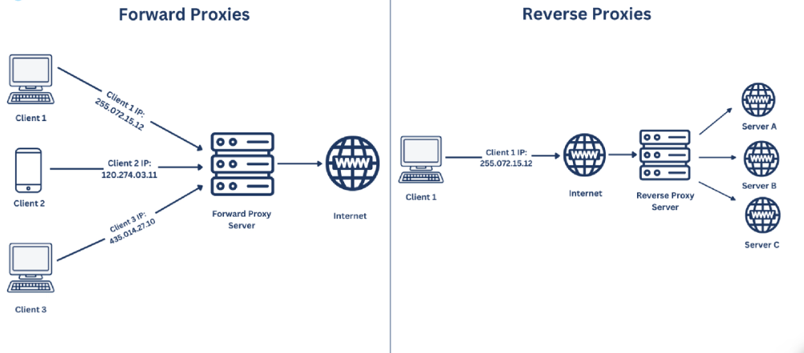
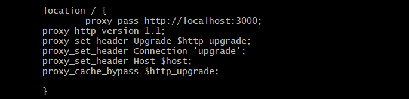

# Nginx Reverse proxy

## What is reverse proxy

A reverse proxy is a server that acts as an intermediary between clients and a web server, forwarding client request and returning the server's responses.
 

### ***Difference between a forward proxy and reverse***

A forward proxy hides the client's IP and bypasses internet restrictions, while a reverse proxy hides the identity of a web server and provides security. 

A forward proxy are on the client's device or network, while reverse proxy sits between the client and the web server. 

# Ports

Ports are virtual **channels** that software applications use to communicate with each other. 

They are like numbered doors on a server computer that allow different services or applications to run on the same machine. 

For example, when you access a website using your web browser, the web browser connects to the server using **HTTP** protocol, which is typically assigned to port ***80***.

## Most common ports

1. Port 80 - HTTP (Hypertext transfer protocol)

2. Port 443 - HTTPS (HTTP secure)

3. Port 22 - SSH (Secure Shell)

4. Port 53 - DNS (Domain Name System)

5. Port 25 - SMTP (Simple Mail Transfer Protocol)

6. Port 110 - POP3 (Post Office Protocol version3)

7. Port 143 - IMAP (Internet Message Access Protocol)

8. Port 21 - FTP (File Transfer Protocol)

9. Port 3389 - RDP (Remote Desktop Protocol)

## Nginx and its default configuration

Nginx is open source software for **web serving, reverse proxying, caching, load balancing, media streaming** and more. 

It started out as a web server designed for maximum performance and stability. 

# How to set up Nginx reverse proxy

The reason why we would want reverse proxy is for **protection from attacks**. 

With reverse proxy in place, a web site never needs to reveal the IP address of their origin servers. This makes it much harder for attackers to breach. 

Let's have a look have we can implement that. 

- First we have to navigate back to our VM's system in GitBash using `vagrant ssh`. 

- When we are inside our VM we need to configure Nginx defautl setting using the following command `sudo nano /etc/nginx/sites-available/default`.

- Then we need to navigate down the file and find a server block and replace is it the following code :

- We will have to change the port number as well. In our case it would be "3000".

- To save and exit use `ctrl+x`, `y` for yes and enter.

- Then, we use the following command `sudo nginx -t`

- And lastly, we restart nginx program to ensure that the changes have been applied using `sudo systemctl restart nginx`

- To check the functionality we try to enter the IP address we gave to our VM into our browser without the port number.

