# tech201_virtualization
## Devops and Development Environmets

## Introduction

### Cloud

Cloud computing is a way of using the Internet to access and store information and technology services, such as computing power, storage space, and software. It offers several benefits over traditional ways of computing, including:

- Flexibility: You can easily adjust the amount of computing resources you use, depending on your needs.
- Cost-effective: You only pay for what you use, and don't need to invest in expensive hardware.
- Reliable: Cloud service providers typically offer high levels of uptime, ensuring your information and services are always available.
- Accessible from anywhere: You can access your information and services from any device with an internet connection.
- Disaster recovery: Your information and services are protected against natural disasters and other disruptions.
- Better collaboration: You and your team can work together more effectively using cloud-based tools and services.
- Safe and secure: Your information is protected by the latest security measures provided by the cloud service provider.
- Stay up-to-date: You can take advantage of new and innovative technologies as they become available.
- Compliance: You can meet industry regulations and standards, such as those related to privacy and data protection.
- Eco-friendly: Cloud computing can reduce the energy consumption and carbon footprint associated with computing.

### 4 Things of DevOps

**1.Ease of use**- Other teams are going to use the tools we create(they won’t use them if they aren’t user-friendly). If Devs do not use our tools then there will be delays in deployment down the line.

**2.Flexibility** - It can be easy to get locked into using a specific product, tool or software and then it becomes hard for the company to keep up with industry changes.(Everything the company uses should be easily changed or updated as the business needs change.

**3.Robustness** - We need as close to 100 % uptime as possible for our company’s services (We are responsible for achieving this as DevOps engineers).

**4.Cost** - Cost is often overlooked. We need to make sure the company is being as efficient as possible in it’s tech dealings. (For example how powerful a machine do we need to conduct a task ? Do we need certain servers running? etc

### ***Monotlith***
A monolithic architecture is a singular, large computing network with one code base that couples all of the business concerns together.

To make a change to this sort of application requires udating the entire stack by accessing the code base and building and deploying an updated version of the service-side interface.

# Development Environments 
Area where developers can run their code in and test it (A space on some machine that has all the tools required for testing and development).

As Devops engineers one of our jobs is to create these areas ( We have to choose the tools they use because we have to full areas in mind and we want to control it).

### What makes a good Dev environment:

1. User friendly, fast and robust
2. It should be easy to update and change if new change is required
3. It should match the production environment as closely as possible
4. It should be the same for everyone, everywhere (has to configured the same way on all the machines)
5. It should only support one application (if App1 requires version 1.1 and App 2 requires version 1.4 it will not work)

Additional notes: Do not try to mix and match!!

If App 1 needs a program and that program conflicts with a program that App2 needs. 

## Setup: 
1. Install Ruby:This program works with the VM creater.: [Install link](https://rubyinstaller.org/downloads/)

2. We can double check our version of Ruby in GitBash(run as admin) with command ruby --version

3. Install Virtual Box: This creates VM's: [Install link]( https://www.virtualbox.org/wiki/Download_Old_Builds_6_1)

4. Go to "Turn Windows on and off" and make sure that Hyper-V is disabled and Virtual Machine Platform and Windows Hypervisor Platform is enabled.

5. Install Vagrant from their official website(the install may require a restart of your machine)
To double check it has been install you can open GitBash (run as admin) and type `vagrant --version`.
That should print out the following message if the install was succesful `Vagrant 2.2.7`.

6. In GitBash you have to navigate to the right folder with `pwd` command.
If you encounter a problem with that it could be an issue of the folder having a space in the name.

In case your folder has a space in it, GitBash won't like to so use `''` single quotes to cd(change directory) to the right folder. Please follow these instruction:

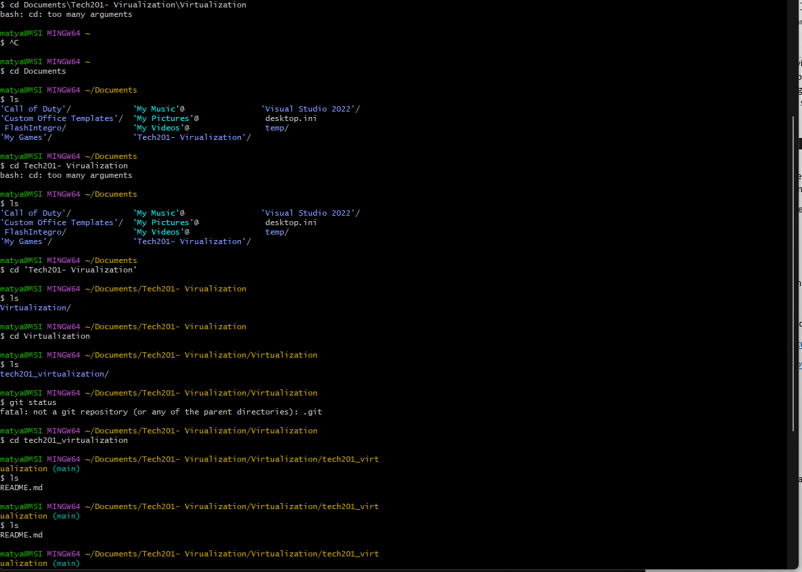

7. After that we can open back the GitBash and write a command `vagrant init ubuntu/xenial64`. This creates a file in VS code. Only configuration file (We haven't actually created a VM yet). This file contains instructions that are used to give to our Virtual Box.
Enables us to standardize the dev environment that we are giving to our Developers.

8. Now we want to test the functionality running `vagrant up` in GitBash. (Check Oracle if the machine is running)

9. Then we check the functionality `vagrant status`.

10. If we all running with no issues we want to connect to it using `vagrant ssh` in GitBash.
(This program handles all security processes for us)
 
11. Then we can use `ls -a` to show all the folders + hidden folders.

12. Then we can start using `sudo` code which basically means that we wanna get right permissions. We want to start using the web server:#####

13. Now that we are in `vagrant@ubuntu-xenial` we can notice how the colours disappeared.

14. Being inside the VM we can run `sudo apt-get update -y`. This command will update the core function of our VM. Also comfirms the access to the Internet.

15. After we use `sudo apt-get install nginx -y` to install program for our website.

16. Next step is to use `sudo systemctl start nginx`. Lastly `sudo systemctl status nginx`.

17. For easier access for developers we have to use this command `config.vm.network "private_network", ip:"192.168.10.100"`. (This gives our VM an IP address to access)

18. Then we can back out of the VM using `exit` command and use `vagrant reload` to reboot the VM.

To connect to the machine vagrant ssh in git bash then we should be inside the machine 

 Sudo apt-get update -y downloads all the updates9 (confirms the access to internet)
 Sudo apt-get install nginx -y (installs programs)
Sudo systemctl start nginx
Sudo systemctl status nginx
Exit
Vagrant reload

We imported the *app* and *environment* into our directory with the vagrant file after destroying current machine. (Dont forget to extract them first and insert them into the directory with the vagrant file)

Then we use this code in our Vagrant file `config.vm.synced_folder "app", "/home/vagrant/app"` to specify what to work with(app) and where we want to go. 

- We need to cd into `environment` and then cd into `spec-tests` in VS code.

- Then in the terminal we have to navigate (cd) to `environment` and `spec test` and then we run `gem install bundler`. This command is used to install the `bundler` gem, which is a gem management tool for **Ruby** projects.

- Then run `bundle`. This is used to install all the required gems, update the gems to the latest versions or resolve any version conflicts between gems.

- Then run `rake spec` to run the tests (check for any failures that need to be fixed)

- After that we need to fix all the errors we received in VS terminal. We do that in GitBash with following steps:

- In GitBash we run `sudo apt-get update -y` to update packages

- Then we run `sudo apt-get upgrade -y` to actually makes the changes that we updated (install changes)

- Then we run `sudo apt-get install nginx -y` This is used to install the `nginx` software package.

- After that we run   `sudo systemctl enable nginx` to enable the system.

-  Then we can open our browser to double check if nginx is working properly by typing the IP address from our Vagrant file 

- Then we check the failures again `rake spec`

 and we follow with these commands in GitBash: 

 ### Install nodejs

- `sudo apt-get install python-software-properties` This serves to install `python-software-properties` package.

- `curl -sL https://deb.nodesource.com/setup_6.x | sudo -E bash -`. This command is used to install Node.js in Linux system including those running GitBash. The command will download and execute a shell script that sets up the Node.js and prepares the system for installing Node.js using the following `apt-get` command.

- `sudo apt-get install nodejs -y` This install the Node.js

- To check if that particular failure has gone we can run `rake spec` in out VS terminal. 

- Then we move onto fixing the remaining failures 

### Install pm2

- To install pm2 package we run `sudo npm install pm2 -g` to install pm2 package globally (`-g`).

- Again we should run `rake spec` in our VS code terminal to see if we have anymore failures.

- In GitBash `cd app` will change th current working directory to the `app` directory.
If the `app` folder exists in the current working directory, the command will change to that directory. 

### Note:

- If the directory does not exits in the correct location, the command in return an error message indicating that the directory does not exist. 

-  `npm install` command is used to get all the necessary files for a Node.js. It does this by reading the `package.json` file and downloading the necessary files and putting them in a folder called `node_modules`. This makes the project ready to use!

- `node app.js` will start the Node.js application specified in the `app.js` file. The JavaScript code in the `app.js` file will be executed by the `node` tool, allowing you to run the Node.js  application on a server(output: Your app is ready and listening on port 3000).

- And lastly we go back to our web browser and next to our IP we input `:3000` as in the port that the app is working on.

### To boot back up:

- Open GitBash and cd into the `main`. Simply follow the path.

- Once you are in the `main` use `vagrant up` to start up your VM. This could take a few seconds.

- To get into the VM's  system use `vagrant ssh` which handles the security side of the process as well. 

- To exit the VM's system simply write `exit` and this takes you back to you host OS system.

# Provisioning 
 
This allows us to install the necessary packages without entering the actuall VM's system. 

- We created provision.sh (sh=shell) folder and this should be in the same directory as the Vagrant file. 

- After that we need to ammend the Vagrant file instructing it to configure the VM's provision using "shell" and direct the path to the "provision.sh" folder as seen bellow:

- `config.vm.provision "shell", path: "provision.sh"`

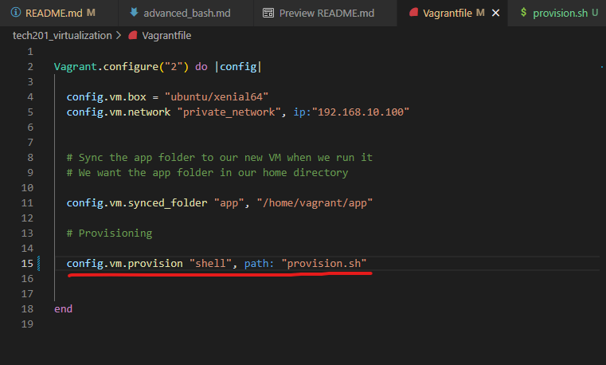

### Then we move onto our "provision.sh" file

- First of all we will need this code at the top `#!/bin/bash` and after we follow these steps:

- `sudo apt-get update -y` `-y` is to automate the response to yes

- `sudo apt-get upgrade -y` to upgrade 

- `sudo apt-get install nginx -y` to install nginx

 - `sudo systemctl enable nginx -y`  to enable nginx

- go back to vagrant file `config.vm.provision "shell", path: "provision.sh"`. This specifies that we want to configure the VM's provision using "shell" and path to that will be the provision.sh file that we created where we will feed the install instructions.

- then we run `vagrant up` in VS code

- If you encounter this problem "The SSH command responded with a non-zero exit status. Vagrant
assumes that this means the command failed. The output for this command
should be in the log above. Please read the output to determine what
went wrong"
-  Then we open Gitbash and run `vagrant ssh` to enter the VM and  `ls` to check if the app folder is in.
- Then we check if we have nginx installed by using `nginx -v`
-   If you get this output `nginx version: nginx/1.10.3 (Ubuntu)` then you have nginx installed
- Then we do `sudo systemctl status nginx`

### Recap of the full process in the provision.sh

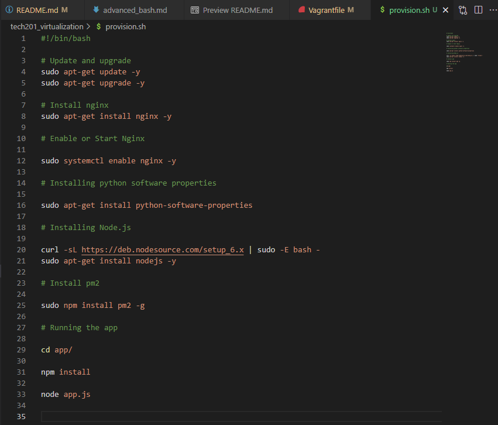

- Make sure you input all the codes that are shown in the picture above. 

- When all the codes are put down you can use Bash terminal to destroy the current machine using `vagrant destroy` and then `vagrant up` to reboot the machine with the new installments.

- To check the functionality we can open our web browser and type in the IP address we gave to the VM + the port that the app is working on. In this case "3000".

# How to create two VM's using one vagrant file

- Firstly, it is recommended to update the version of node in our app inside the provision.sh file using `curl -sL https://deb.nodesource.com/setup_12.x | sudo -E bash -`

- Don't forget to comment out the following lines off code in your provision.sh file as well for when you `vagrant up` the machines, these won't install automatically.

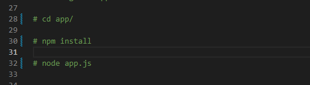

- We also need to update our Vagrant file to define the database as well as follows:

- Note that to database VM we assigned a different IP address. You can use anything with ending below 255 and of course different from the app IP. Also each `end` in those code blocks relates to particular VM set up. The last `end` to wrap up the end of the file. 

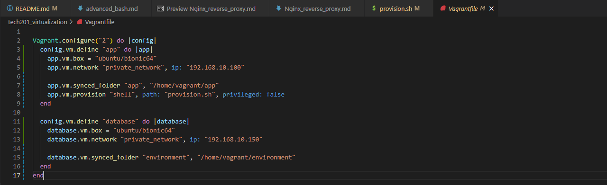

- To set a new VM we need to use the following command `config.vm.define "database" do |database|`- "app" being the name that we want to give it, |database| being the pipes

- We need to destroy any existing VM's "`vagrant destroy`" in our VS code bash terminal. 

- Write `vagrant up` to boot up both machines. Make sure your Oracle V box is opened as admin and also to check if both machines are running correctly. This might take a while because of the provisioning we set. 

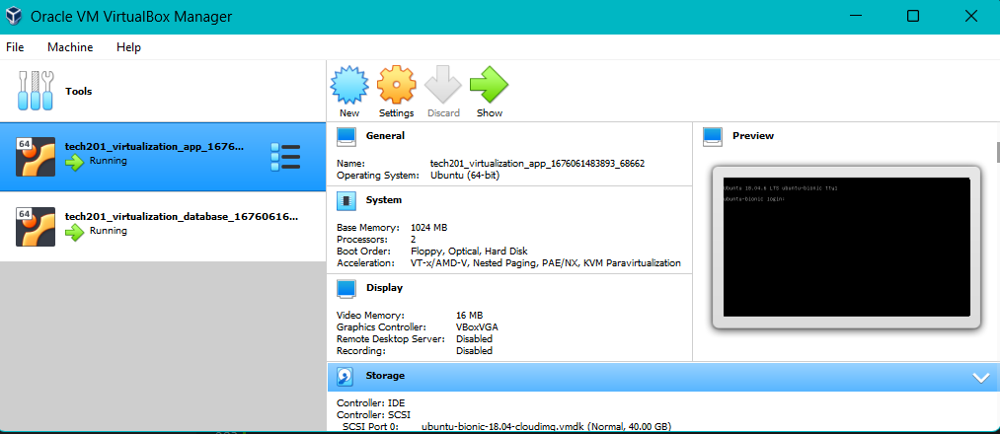

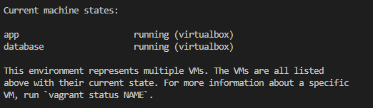

- If we would like to destroy particular machine we can run either `vagrant destroy database` or `vagrant destroy app`

- Next step is to make sure to open 2 separate GitBash terminals as admin and run `vagrant ssh app` on one terminal and `vagrant ssh database` on the other to enter both machines.

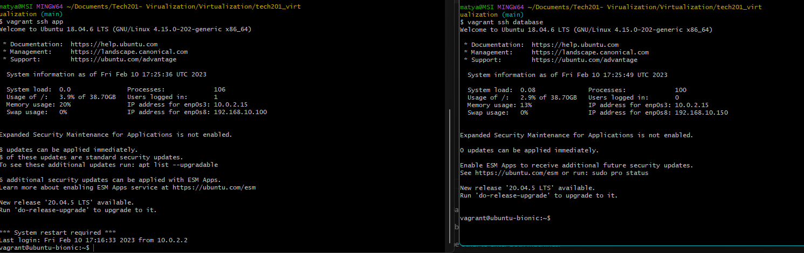

- To double check the correct location we can use `ls` in both terminals.

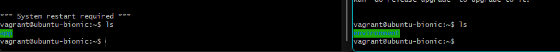

- We can also check if the provisioning was succesful in the "app" VM by using following commands: `nginx -v` and `node -v`.

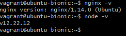

- Inside the database machine we need to install the database and we will need a release key for that - `sudo apt-key adv --keyserver hkp://keyserver.ubuntu.com:80 --recv D68FA50FEA312927  # A confirmation of import will be displayed`. This should return the confirmation of the import.

- When everything is up to scratch so far we use `echo "deb https://repo.mongodb.org/apt/ubuntu xenial/mongodb-org/3.2 multiverse" | sudo tee /etc/apt/sources.list.d/mongodb-org-3.2.list`. What this line does is letting us know that the Linux has the right properties to download Mongo.

- After that we input `sudo apt-get update -y` to confirm any packages that can be downloaded.

- Following with `sudo apt-get upgrade -y`. It does not matter if you upgrade before or after the release key. Make sure you don't use upgrade when doing in production environment. It can cause downtime. 

- Now we are ready to install it using  `sudo apt-get install -y mongodb-org=3.2.20 mongodb-org-server=3.2.20 mongodb-org-shell=3.2.20 mongodb-org-mongos=3.2.20 mongodb-org-tools=3.2.20`

- When it is installed we check the status using `sudo systemctl status mongod`

- Following with `sudo systemctl start mongog`
- `sudo systemctl status mongog`
- `sudo systemctl enable mongog`

- We also need to change the configuration of the `mongod.conf` in the folder called "etc" using this command `sudo nano /etc/mongod.conf`

- What we need to look for is the network interface section. 

- By default the bindIP will be 127.0.0.1 and we need to change that to 0.0.0.0 for any IP with any range could connect to it. This is not best practice for production environment. 

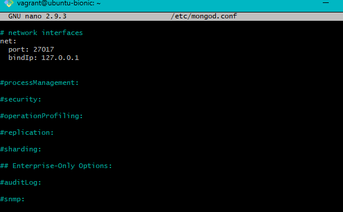

- After that we will need restart mongodb `sudo systemctl restart mongod` and following with enabling it `sudo systemctl enable mongod`
- Now our database should be set up and we can check the status of it `sudo systemctl status mongod`

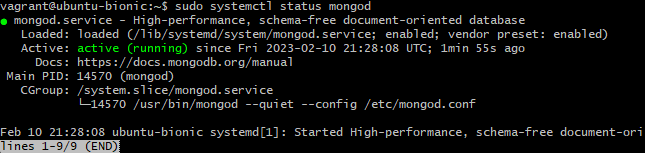

Although it is active we are not connected yet. We open our app terminal. If we haven't entered the machine yet we do that using `vagrant ssh app` and then we need to make sure we cd (change directory) into the right location: `ls`, `cd app` `ls` and this should be the output. 

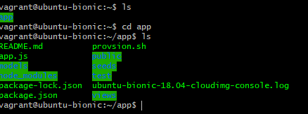

- If we have reached this point with no issues we have to create environment variable. This allows us to set a variable that is used to specify the information about the particular environment. 

### **Difference between the normal variable and environment variable**

---

***Normal variable*** is only available in current process that you are running. Only accessible in the Bash terminal. 

***Environment variable*** is accessible from any environment. To print out all environment variable use `printenv`. By default, the environment variables are non-persistent.

***Persistent variable*** stays in the environment even if the environment closes. Any variables that were made non-persistent will not exist anymore. Altough they will be destroyed if the machine will be destroyed. 

**Now we need to create an environment variable that will be persistent. This allows the app VM to connect to the database VM.**

- First we need to navigate back to app.js using `cd app` and check if we are in the right location `ls`. The following picture is what the output should be:

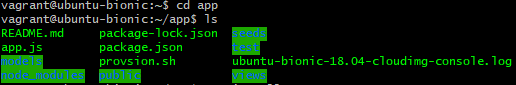

- Now we need to create an environment variable called `DB_HOST=mongodb://192.168.10.150:27017/posts` and the command for that would be simply adding `export` at the start of the variable. 

- Another way we could do that is by using following code: `sudo nano .bashrc` to enter and edit this hidden file. If you wish to use this method you will have to back out of the app.js using `cd ..`.

- To run a file `source .bashrc`

- To showcase `printenv`. If we are looking for a specific variable we use `printenv DB_HOST`.

We do this in order to specify where to go and connect to mongodb. We need to tell our app in some way where we want it to connect.

- The next step is to navigate into our app.js `cd app`.

- `npm install` this command will install our app

This following command is running node.js file that the developers have made that sets up the database. In order to run that command we need to set up the connection (env variable) between our app and database. 

- **Almost done!** Another command we need to run is `node seeds/seed.js` where "seeds" being the folder and "seed.js" being the file.

The output:

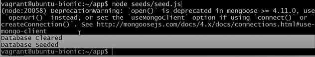
 

## Note

In the previous output the "Database seeded" means that the database is populated on the db machine. 

Lastly, we run the app `node app.js`

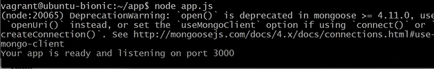

If you receive the output above then we are all up and running and we can check the functionality by opening our web browser, inputing the IP address we to our app VM + `/posts` at the end . Congrats!!

# Note

In case you receive the following error when trying to run the `node app.js` app this means that you might have to kill certain processes. As we can see the port 3000 is already in use. The reason behind this could be that we ran the app before we created the variable to establish the connection. 

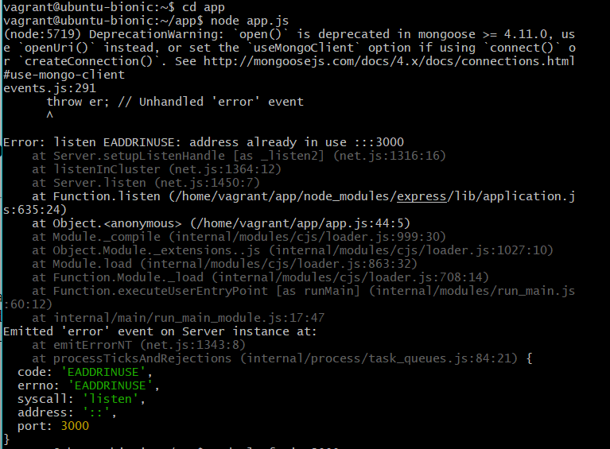

To resolve this we have to use command `sudo lsof -9 :3000` which means to list out the current processes and at the end we specify the port number that was in use. 

After the processes have been displayed we use `kill -9 5666` to kill the required process before can run the app again. 

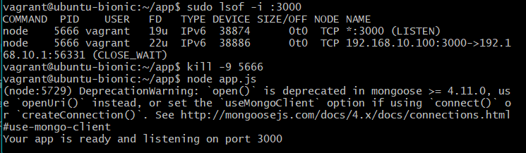

The picture below indicates that it pulls the posts from the database because we have the connection and it can be displayed as so:
This wouldn't happen if we didnt have the seed even thought the connection is running. 
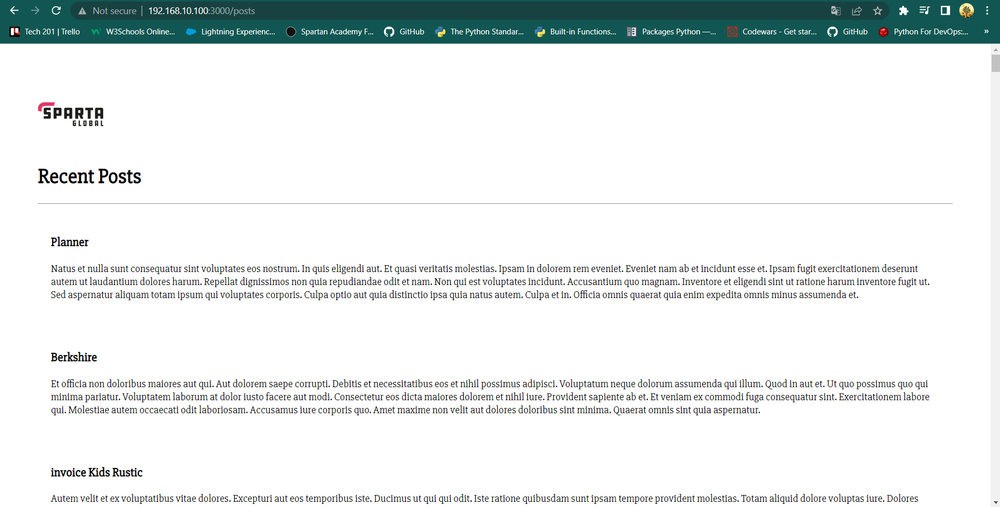

### Environment diagram

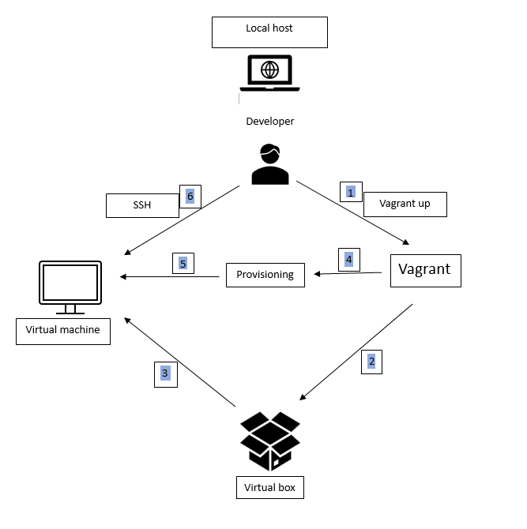

---

### Folder diagram
 
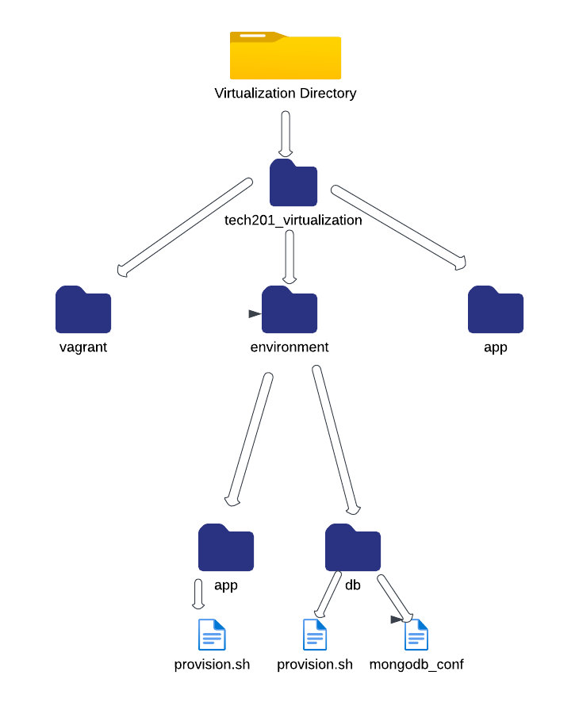

